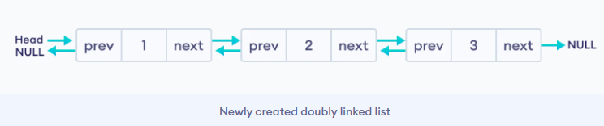
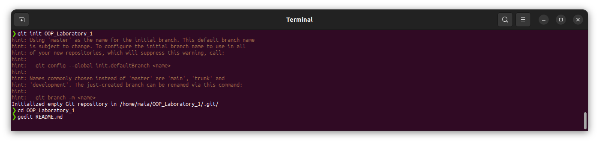

# Data Structures
## Linked list

Linked List can be defined as collection of objects called nodes that are randomly stored in the memory. Here, each node stores the **data** and the **address** of the next node. For example,


You have to start somewhere, so we give the address of the first node a special name called `HEAD`. Also, the last node in the linked list can be identified because its next portion points to `NULL`.

### Uses of Linked List

- The list is not required to be contiguously present in the memory. The node can reside any where in the memory and linked together to make a list. This achieves optimized utilization of space.
- List size is limited to the memory size and doesn't need to be declared in advance.
- Empty node can not be present in the linked list.
- We can store values of primitive types or objects in the singly linked list.

### Types of Linked List

Linked list is classified into the following types -
* **Singly-linked list** - Singly linked list can be defined as the collection of an ordered set of elements. A node in the singly linked list consists of two parts: data part and link part. Data part of the node stores actual information that is to be represented by the node, while the link part of the node stores the address of its immediate successor.
* **Doubly linked list** - Doubly linked list is a complex type of linked list in which a node contains a pointer to the previous as well as the next node in the sequence. Therefore, in a doubly-linked list, a node consists of three parts: node data, pointer to the next node in sequence (next pointer), and pointer to the previous node (previous pointer).
* **Circular singly linked list** - In a circular singly linked list, the last node of the list contains a pointer to the first node of the list. We can have circular singly linked list as well as circular doubly linked list.
* **Circular doubly linked list** - Circular doubly linked list is a more complex type of data structure in which a node contains pointers to its previous node as well as the next node. Circular doubly linked list doesn't contain NULL in any of the nodes. The last node of the list contains the address of the first node of the list. The first node of the list also contains the address of the last node in its previous pointer.

### Basic Operations

Following are the basic operations supported by a list.
* *Insertion* − Adds an element at the beginning of the list.
* *Deletion* − Deletes an element at the beginning of the list.
* *Display* − Displays the complete list.
* *Search* − Searches an element using the given key.
* *Delete* − Deletes an element using the given key.

### Representation of Linked List

Let's see how each node of the linked list is represented. Each node consists:
* A data item
* An address of another node

We wrap both the data item and the next node reference in a struct as:
```c
struct node
{
  int data;
  struct node *next;
};
```

### Doubly Linked List

A doubly linked list is a type of linked list in which each node consists of 3 components:

* `*prev` - address of the previous node
* `data` - data item
* `*next` - address of next node


**Representation of Doubly Linked List**
Let's see how we can represent a doubly linked list on an algorithm/code. Suppose we have a doubly linked list:


Here, the single node is represented as
```c
struct node {
    int data;
    struct node *next;
    struct node *prev;
}
```


* **Linked List**
    > Append
    > Prepend
    > Reverse
    > Add a value to the specific index
    > Remove a value the from index
    > Sort the linked list, with re-arranging the cells, not just copying values
    > Search for a value
    > Join two linked lists
    * Backwards traversal, use double-linked-list
